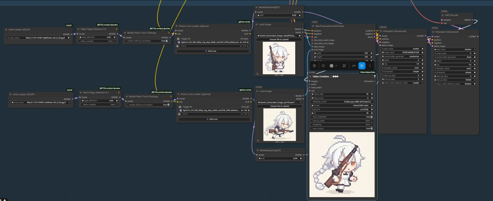

# SpriteLab Studio - AI-Powered Game Asset Suite


**SpriteLab Studio** is a personal project designed to help small and indie game developers speed up their asset creation workflow. It focuses on extracting, refining, and polishing AI-generated game assets—from video-to-sprite transitions to text-to-SFX generation—streamlining the technical hurdles of the creative process.

---

## Key Strengths

- **AI Artifact Cleaning**: Specialized tools to remove noise, hallucination artifacts, and "AI blur" from generated assets.
- **Pixel-Perfect Alignment**: Ensures every frame is mathematically centered and aligned for smooth in-game motion without jitter.
- **Optimized Spritesheet Exporting**: Smart packing algorithms that minimize empty space and provide one-click export for game engines.

---

---

## Core Modules

### Sprite Maker
Transform any video clip into a game-ready spritesheet with our multi-stage pipeline.

#### Visual Workflow

| Step | description | Preview |
| :--- | :--- | :--- |
| **1. Ingest** | Upload your `mp4` or `mov` video clips to begin the extraction process. |  |
| **2. Refine** | Pick the exact frames you want to include in your animation loop. |  |
| **3. Cleanup** | Automatically remove backgrounds using high-precision CIELAB masking. |  |
| **4. Fine Edit** | Adjust brightness, contrast, and apply custom palette remapping. |  |
| **5. Export** | Pack your refined frames mathematically into a pixel-perfect spritesheet. |  |

### Image Editor
A specialized workspace for single-image refinement.
- **Cleanup Tools**: High-precision brush, eraser, and eyedropper.
- **Palette Quantization**: Instantly convert images to iconic styles like **PICO-8**, **GameBoy**, or **NES**.
- **Flood-Fill Isolation**: Isolate complex backgrounds using connected-component analysis.

### Sprite Editor
Import and modify existing spritesheets.
- **Smart Slicing**: Slice sheets by grid or fixed cell size.
- **Batch Editing**: Apply transparency or palette filters to all frames simultaneously.

### Sound Lab
AI-driven SFX creation powered by **AudioGen**.
- **Text-to-SFX**: Generate sounds like "Laser blast", "Sword clang", or "Ambient rain" from simple prompts.
- **Post-Processing**: Fine-tune volume, pitch (resampling), and trim start/end points.

### Animation Lab (In Development)
Bridge the gap between static frames using AI.
- **Keyframe Interpolation**: Uses the **ComfyUI Bridge** (Wan 2.2 / SVD) to generate smooth motion.
- **Workflow Driven**: Integrated with ComfyUI for advanced control.

#### Animation Pipeline (Wan 2.2)


---

## Installation

### Prerequisites
- **Python**: 3.12 or higher.
- **CUDA**: Optional but highly recommended for Sound and Animation modules.
- **FFmpeg**: Required for advanced video processing.

### Setup
1. **Clone the repository**:
   ```bash
   git clone https://github.com/kh4c/SpriteLab-Studio.git
   cd SpriteLab-Studio
   ```

2. **Install dependencies**:
   ```bash
   pip install -r requirements.txt
   ```

3. **ComfyUI Setup (Optional)**:
   For Animation Lab, ensure a ComfyUI instance is running locally (default: `http://127.0.0.1:8188`).

---

## Usage

1. **Start the server**:
   ```bash
   python server.py
   ```
2. **Open the App**:
   Navigate to `http://127.0.0.1:5000` in your browser.

---

## Technical Details

| Feature | Tech Used |
| :--- | :--- |
| **Backend** | Flask (Python) |
| **Frontend** | Vanilla JS, CSS (Dark Theme) |
| **Img Processing** | OpenCV, Pillow, NumPy |
| **Audio AI** | Facebook AudioGen (AudioCraft) |
| **Animation AI** | ComfyUI Bridge (Wan2.2 / SVD) |
| **Color Space** | Perceptual CIELAB for bg-removal |

---

## Contributing
Feel free to open issues or submit pull requests. Let's make game asset creation accessible to everyone!

---

*Developed with the goal of making game development faster and more creative.*
